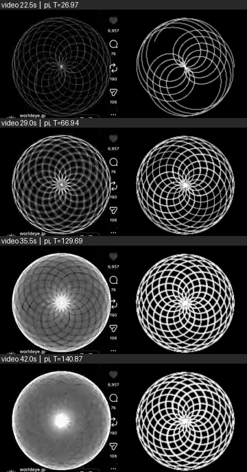

# Reference Reconstruction — analysis

Generated by `tools/reference/analyze.py` from `infinite-lab-source-reference.mp4`
(180×320, 2 fps, 101 frames; 40 frames show the whole drawing and were compared).

Candidate family: **z(t) = e^{it} + e^{i·c·t}** (two equal arms; arm 2 turns c× as fast) — Experiment 04 `two-arm`.
Features: radial brightness profile (24 rings) + angular spectrum (petal symmetry), both rotation-invariant.
For each frame and candidate, the drawing time T is searched on a grid; the smallest feature distance is kept.

## 1. Symmetry test (decisive)

In the video the drawing shows a clear **15-fold** petal symmetry in 20 frames (22.5–34.0 s), which then disappears (11 later frames without order 15 among the three strongest).
A candidate passes if it (a) produces a dominant order of the same value at some drawing time and
(b) later loses it, as the video does.

| ratio c | (a) shows 15-fold | (b) then loses it | dominant orders seen | verdict |
|---|---|---|---|---|
| π | yes (first at T ≈ 44.28) | yes | 2, 4, 15, 30 | **consistent** |
| 355/113 | yes (first at T ≈ 44.28) | yes | 2, 4, 15, 30 | **consistent** |
| 22/7 | yes (first at T ≈ 44.28) | no | 2, 4, 15 | **rejected** |
| 3.2 | no | no | 1, 2, 22 | **rejected** |
| √10 | no | no | 1, 4, 13, 16, 20, 40 | **rejected** |
| 3 | no | no | 4 | **rejected** |
| e | no | no | 1, 2, 4, 5, 7, 12, 26, 40 | **rejected** |
| φ+1 | no | no | 1, 4, 5, 8, 13, 24, 40 | **rejected** |

For two equal arms with ratio c ≈ p/q the curve nearly closes with p − q petals; π ≈ 22/7 gives 22 − 7 = 15.
Exactly 22/7 closes and keeps its 15 petals forever, which contradicts the later frames.

## 2. Feature distance (auxiliary)

Radial brightness + angular spectrum, smallest distance over drawing time. The radial part converges for any
irrational ratio and depends on the assumed glow model, so this table alone does not discriminate well.

| ratio c | mean distance | worst frame | worst excess over best candidate |
|---|---|---|---|
| φ+1 | 0.529 | 0.705 | 0.201 |
| 355/113 | 0.596 | 0.790 | 0.392 |
| π | 0.596 | 0.790 | 0.392 |
| √10 | 0.669 | 0.769 | 0.294 |
| e | 0.670 | 0.831 | 0.290 |
| 22/7 | 0.706 | 1.027 | 0.621 |
| 3.2 | 0.904 | 1.306 | 0.910 |
| 3 | 1.813 | 2.390 | 1.995 |

Lower is better. *Excess* is how much worse the candidate is than the best candidate on its worst frame.

## 3. Per-frame best drawing time for c = π (feature distance)

| video time | best T (π) | distance |
|---|---|---|
| 22.5 s | 26.97 | 0.430 |
| 23.0 s | 26.97 | 0.443 |
| 23.5 s | 26.97 | 0.451 |
| 24.0 s | 26.97 | 0.473 |
| 24.5 s | 26.97 | 0.499 |
| 25.0 s | 26.97 | 0.474 |
| 25.5 s | 26.97 | 0.507 |
| 26.0 s | 26.97 | 0.564 |
| 26.5 s | 26.97 | 0.495 |
| 27.0 s | 26.97 | 0.570 |
| 27.5 s | 26.97 | 0.499 |
| 28.0 s | 26.97 | 0.604 |
| 28.5 s | 26.97 | 0.595 |
| 29.0 s | 66.94 | 0.602 |
| 29.5 s | 66.94 | 0.585 |
| 30.0 s | 66.94 | 0.522 |
| 30.5 s | 66.94 | 0.544 |
| 31.0 s | 85.78 | 0.522 |
| 31.5 s | 66.94 | 0.532 |
| 32.0 s | 72.71 | 0.497 |
| 32.5 s | 85.78 | 0.495 |
| 33.0 s | 85.78 | 0.488 |
| 33.5 s | 85.78 | 0.523 |
| 34.0 s | 119.4 | 0.547 |
| 34.5 s | 101.21 | 0.577 |
| 35.0 s | 129.69 | 0.569 |
| 35.5 s | 129.69 | 0.592 |
| 36.0 s | 129.69 | 0.631 |
| 36.5 s | 129.69 | 0.657 |
| 37.0 s | 129.69 | 0.665 |
| 37.5 s | 129.69 | 0.694 |
| 38.0 s | 129.69 | 0.725 |
| 38.5 s | 140.87 | 0.772 |
| 39.0 s | 140.87 | 0.790 |
| 39.5 s | 140.87 | 0.782 |
| 40.0 s | 140.87 | 0.781 |
| 40.5 s | 140.87 | 0.777 |
| 41.0 s | 140.87 | 0.787 |
| 41.5 s | 140.87 | 0.787 |
| 42.0 s | 140.87 | 0.786 |

## Interpretation (what this does and does not show)

- The candidates are compared only through blurred, rotation-invariant features of a 180×320 recording.
- Ratios very close to π (e.g. 355/113) produce the same pictures until very long drawing times and
  **cannot be distinguished** from π with this video.
- Arm-length ratio, drawing speed, colours and glow are not determined by this analysis; the rendering
  model (additive glow + blur) is an assumption.
- Per spec §40 this is *not* called a reproduction: the video is **consistent with** c = π (or a ratio
  indistinguishably close to it, such as 355/113) and **rejects** the other candidates listed above.
